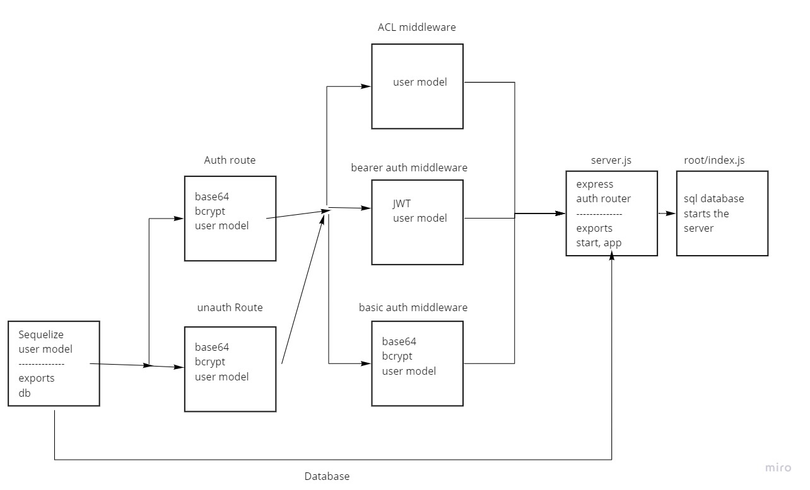

# API-Auth-server

This is an application that deploys the use of an API server to perform database operations and uses login/auth/acl to control access to the resources. You can create an account with a password, login with an account, edit account details and delete an account

## Task Submission

1. [PR Link](https://github.com/nour-alsatari/API-Auth-server/pull/7)
2. [Deployed Version](https://api-auth-server-project.herokuapp.com/)

## UML Diagram

